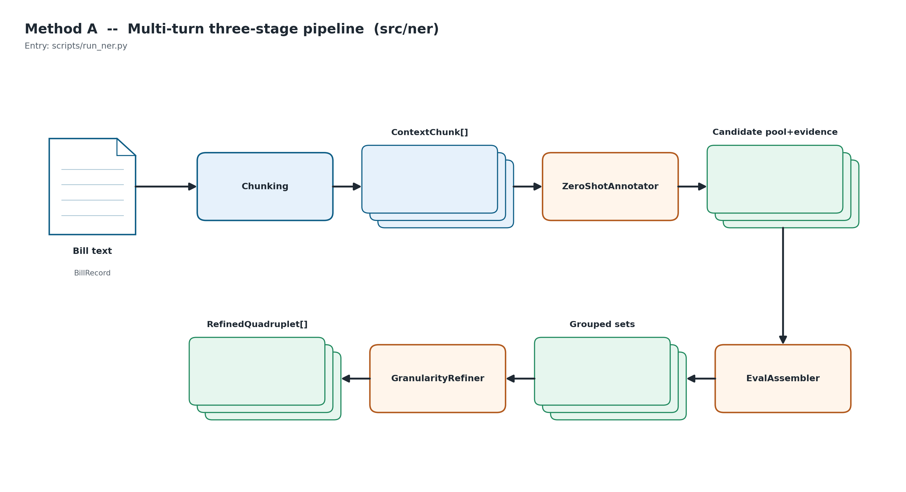
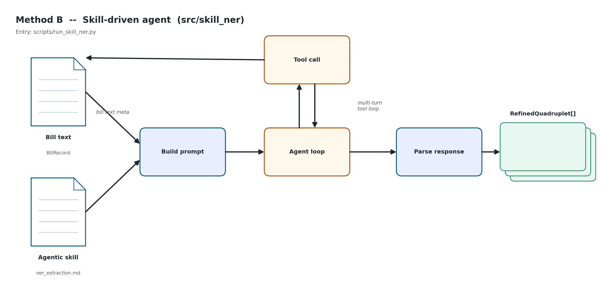

## The scale of state AI lawmaking

- **1,877** state AI bills introduced 2023–2025 (NCSL), in which 2025 alone accounts for **1,262** bills.
- Bills span health, education, procurement, consumer protection, generative AI, ...

. . .

**How is AI being governed?** → requires reading *inside* each bill, not just labels and topics.

---

## Current labels collapse the bundle

Existing dataset labels each bill with one *document-level* topic or keyword

- Two bills both labeled as **"Effect on Labor/Employment"** can do completely different things
  - NY A 8179 in 2024: taxing corporations that replace workers with AI
  - NJ S 3432 in 2024: subsidizing the AI industry and AI data centers

. . .
  
- Collapsing this into one label creates:
  - Measurement error across heterogeneous instruments
  - Diluted effect sizes in downstream analysis
  - No visibility into *who* is regulated, and *how*

---

## Task definition: unpack the bill

Extract **governance quadruplets** from each bill:

| Key | Value |
|---|---|
| **entity** | what / who is regulated |
| **type** | category of the entity |
| **attribute** | regulatory mechanism (mandate, prohibition, disclosure, ...) |
| **value** | specific content of that mechanism |

- Every Key:Value pair attached with a **verbatim evidence span** from the bill
- no fine-tuning or training, no pre-defined taxonomy

---

## Contributions

1. **Generalizable pipeline**: only the skill file is domain-specific; swap it to re-target another policy corpus
2. **Evaluation on pipelines**: prompt-based fixed-plan pipeline vs. skill-driven agentic architecture on the same long corpus, with the same model, for same task.
3. **Open artifacts**: both the output quadruplet and the evidence spans are open for inspection, breaking the black box of LLMs.

---

## Data: 1,826 U.S. state AI bills

:::: {.columns}

::: {.column width="55%"}
- Source: AI legislation tracker from National Conference of State Legislatures (NCSL)
- Years: 2023, 2024, 2025
- After filtering empty-text rows: **1,826 bills**
:::

::: {.column width="45%"}
{width=100%}
:::

::::

---

## Data: topic(coarse labels) + status coverage

:::: {.columns}

::: {.column width="50%"}
{width=100%}
:::

::: {.column width="50%"}
{width=100%}
:::

::::

---

## Related works

Three recent works closest to our task: what each contributed, and why we couldn't use them directly.

- **Wang et al. 2025** (cooperative multi-agent NER)
    - Demonstrated a multi stage pipeline for zero-shot NER
    - Requires a pre-defined taxonomy as target
- **Xu et al. 2025** (entity-attribute-value triplets)
    - Proposed a triplet extraction format for better granularity
- **Islam et al. 2025** (ensemble of multiple agents)
    - Shows a multi-turn pipeline with scoring can improve stability and accuracy

---

## Proposed methods: same task, different approaches

Both output quadruplets with evidence spans; both call Claude Sonnet 4.5 (T=0.0, 16,384 max completion) via OpenRouter.

:::: {.columns}

::: {.column width="50%"}
### Method A: Multi-turn pipeline
- Fixed three-stage plan
- Built from multi-stage NER literature
- Bill split into chunks → staged artifacts
:::

::: {.column width="50%"}
### Method B: Skill-driven agent
- Orchestrated by agent rather than a fixed plan
- Agentic skill drives the agent's behavior
- Section-reader tool: agent reads bill sections on demand
:::

::::

---

## Method A: Multi-turn three-stage pipeline

1. **Candidate annotation**: zero-shot annotator reads chunk by chunk; outputs candidate quadruplets + evidence spans linked to each field
2. **Grouping & scoring**: groups candidates that refers to the same potential entity; outputs perfield score matrix based on evidence
3. **Refinement**: refiner outputs one *refined* quadruplet per group based on score and evidence.

---

{width=100%}

---

## Method B: Skill-driven agent

- **Agentic Skill**:  defines the quadruplet schema, the extraction process, per-field quality criteria, and the required output JSON format
- **Section-reader tool**:   returns bill text slice for a given range chosen by the agent each call
- **Main agent loop**: multi-turn agent calls until reaches the final answer; tool calls results re-enter next turn

. . .

Key difference: the agent *decides* which sections to read and when to stop, instead of following a fixed plan.

---

{width=100%}

---

## Evaluation: four LLM-judge tests

| # | Test | What it measures |
|---|---|---|
| 1 | Quadruplet grounding | Does the bill text support each quadruplet? |
| 2 | Quad-to-label coverage | Do quadruplets cover all NCSL topic labels? |
| 3 | Method comparison by bill | Which method's output does the judge prefer? |
| 4 | Judge bias audit | How often does the judge change its mind under prompt nudges? |

---

## Evaluation: setup

- Judge: **Gemini 2.5 Pro**, T=0.0 
    - Different family from extractor to prevent self-preference
- Pre-filter keeps grounded spans: Multi-turn 95.89% → 10,429; Skill 93.42% → 8,926

---

## Test 1: Per-quadruplet grounding

:::: {.columns}

::: {.column width="55%"}
- **Contradicted**: the direct failure signal: is tied:
  - Multi-turn 3.39% vs Skill 3.61%
- Supported ration gap is confounded with volume of quadruplets (Method A outputs 1,503 more items)
- Skill's higher *neutral* (18.1% vs 11.6%) tracks agent's paraphrasing tendency
:::

::: {.column width="45%"}
{width=100%}
:::

::::

---

## Test 2: Set-to-label coverage (the headline result)

:::: {.columns}

::: {.column width="55%"}
- **Strict coverage**: Skill **81.50%** vs MT **49.44%** → **+32.06 pp**
- Coverage rate (strict + partial): Skill 83.7% vs MT 80.3%
- MT strict drop: judge's cited supporting ids fail the integrity check
:::

::: {.column width="45%"}
{width=100%}
:::

::::

---

## Test 3: Cross-method pairwise preference

:::: {.columns}

::: {.column width="55%"}
- 1,693 bills, judged twice with presentation order swapped
- Judge's Swap averaged: **Skill 75.99%** vs MT 22.68%
- Count-normalised (adjusts for MT's larger output): Skill still leads **3.4×**
- Both shows that the judge prefers the skill-driven agent
:::

::: {.column width="45%"}
{width=100%}
:::

::::

---

## Test 4: Judge bias audit

:::: {.columns}

::: {.column width="55%"}
Judge's decision flips rates on a 100-bill sample:

- Position: **3%**
- Verbosity: **4%**
- Self-preference: **7%**
- Authority: **14%** 

**Implication:** inclusion of input introduced biases prompts carry not much influence on the judge's decision → Tests 1–3 are not contaminated
:::

::: {.column width="45%"}
{width=100%}
:::

::::

---

## Novelty audit: what the labels miss

:::: {.columns}

::: {.column width="55%"}
Grounded-but-not-cited by any NCSL label:

- MT: **6,319**: mix of bill-relevant specifics **and** off-topic extractions (e.g., tax credits, nuclear energy in bills that merely *mention* AI)
- Skill: **1,730**: AI-topical by construction

MT's raw novelty advantage is partly spillover from non-AI portions of keyword-filtered bills
:::

::: {.column width="45%"}
{width=100%}
:::

::::

---

## Resource cost

| Metric (corpus total) | Multi-turn | Skill-driven |
|---|---:|---:|
| LLM calls | 21,586 | 11,231 |
| Tokens | 55.3 M | 90.9 M |
| Dollar cost | \$228.78 | \$315.60 |
| Cumulative LLM time | 27.4 h | 16.2 h |
| **Per bill** | **\$0.125** | **\$0.173** |

- Skill-driven: fewer calls, more tokens/call (running context)
- MT cheaper in dollars; Skill cheaper in calls and wall-time
- Evaluation layer added \$305.72, 78.8 h of judge time

---

## Bottom line: which method to pick

- **Pick Skill-driven** faster to implement and more generalizable by swapping the skill file
- **Pick Multi-turn** if wider, cheaper extraction is needed, even at the cost of bill-adjacent detail
- Either method gives inside-the-bill detail missing from the original document-level labels

---

## Live demonstration

:::: {.columns}

::: {.column width="50%"}
- Deployed at **[ai-policy-qa.onrender.com](https://ai-policy-qa.onrender.com)**
- Submit a bill URL / ID / pasted text → get quadruplets + evidence spans
- 100-question harness:
  - Agent **79/100**
  - RAG baseline 54/100
  - Self-query baseline 59/100
- Mean latency **6.65 s**
:::

::: {.column width="50%"}
{width=100%}
:::

::::

---

## Take-aways & limitations

**Take-aways**

- Skill-driven agent dominates on coverage (+32 pp strict) and pairwise preference (76 vs 23)
- Rewriting the skill file re-targets another policy corpus: orchestration is reusable
- Weeks of manual coding → hours of compute, with traceable spans

**Limitations**

- Single model family (Sonnet 4.5); cross-family replication is follow-up
- U.S. state AI in English; portability claims are method-level
- Demo app hardwired to this corpus: configurable release planned

---

## Thank you

- **Paper, dataset, code, live app:** see project page
- **Contact:** Xingyuan Zhao: [ai-policy-qa.onrender.com](https://ai-policy-qa.onrender.com)

Questions?
