# Abstract

State AI bill research largely relies on document-level theme and keyword labels that treat each bill as a single undivided unit and collapse heterogeneous governance instruments into one row \cite{depaula2024regulating, depaula2025evolving}. Coarse labels cannot answer which sectors, technologies, or applications are regulated, or which actors carry obligations. We propose two extraction methods that unpack the bill. The first is a multi-turn stateful NER pipeline synthesized from recent work on cooperative multi-agent zero-shot NER \cite{wang2025cooperative}, with three stages of candidate annotation, grouping, and refinement. The second is a skill-driven agentic approach enabled by recent LLM tool calling, in which one agent follows a skill file and reads bill sections on demand to produce quadruplets in a single conversation \cite{schluntz2024building, zhang2025equipping}. Both methods extract quadruplets of entity, type, attribute, and value anchored to evidence spans, and run on 1,826 U.S. state AI bills from NCSL covering 2023 to 2025 \cite{ncsl2025ai}. We evaluate coverage of NCSL topic labels using an LLM-as-judge protocol, and report tokens, dollars, and LLM time for each method. The pipeline produces granular policy-design variables that current labels cannot reveal, transfers to other policy corpora by rewriting the skill file, and replaces weeks of manual coding with hours of compute while keeping traceable spans.

# Introduction

## Background

State legislatures have become a focal venue for AI lawmaking in the United States. Between 2022 and 2025, state AI legislation has surged \cite{ncsl2025ai}, with the NCSL tracker recording more than 1,200 state AI bills in 2025 alone \cite{ncsl2025ailegislation2025}. A surge of this magnitude unfolding across many sub domains including heath care, education, and ethical use of AI marks a starting point in which AI governance in the United States is being written.

Treating the AI bill as a single undivided unit without granular entity and relation extraction may be too coarse for downstream research, because the bills are bundles of heterogeneous governance instruments \cite{yoo2020regulation, kuteynikov2022key, sheikin2024principles, wang2024regulating}. Two bills can both count as "policy regulating AI" while doing fundamentally different things, such as one setting procurement rules, yet another establishing constraints on certain technologies. Collapsing this bundle into a single label breaks the downstream analysis in three ways. First is measurement error. The labels might target different procedures or entities but may measured as same category. The second problem is that the reduced effect magnitude when multiple type of relations about one concept are collapsed into one. Third is that the mechanism behind the regulated body and the method of regulation will not be revealed. Without extracting the entity and the relations, the downstream analysis will be hard to understand what policy design moved, which obligations, which targets, which enforcement.

### Problem statement

The broader issue we are encountering here is to connect the entities extracted and the relation of the entities using modern LLM and agentic workflow. Concretely, for a given corpus that is long and involves multiple entities and relations without any predefined taxonomy or gold standard, what entities are being regulated and how? Answering this at this scale requires granular entities and relations: the specific entity being regulated, the type of that entity, the regulatory mechanism attached to it, and the content of that mechanism. These four features separate the target of the bill from the actor carrying the obligation and from the instrument through which the obligation operates; they are not recoverable from a document-level topic or keyword label. A label that says "the bill is about AI" cannot tell apart a bill that regulates a specific AI technology from a bill whose only AI content is only mentioned while the body regulates something else \cite{ri2024s2540}. The task this paper addresses is therefore to produce structured, evidence-anchored extractions of the entity, type, the type of regulation and how it is regulated from lengthy regulatory text at corpus scale.

## How this research benefits the field?

This paper lowers the cost and raises the granularity of AI-policy measurement so that other researchers can ask questions about the granular entities and relations inside each bill without building an extractor of their own. The benefits land in three places.

### Generalizable pipeline for other policy corpora

The extractor is decoupled from the AI-bill domain. The skill file is the only piece that encodes domain content, and it is swappable. A researcher studying financial, environmental, privacy, or health regulation can point the same runner at a new corpus by rewriting the skill file, without reimplementing orchestration, storage, or evaluation plumbing. This is the contribution that other researchers can pick up without first reproducing this paper.

### Empirical comparison of LLM pipelines for long regulatory text

Researchers facing the same kind of task, which is structured extraction from long regulatory documents, currently have no empirical guide for choosing between a fixed-plan multi-stage pipeline and an agentic skill-driven pipeline. This paper runs both on the same corpus with the same model and reports accuracy, bias, and resource cost side by side, so a later project can read off which design to pick for its own task without rerunning the comparison.

### Open dataset, runner, and live demo for downstream research

The released artifacts are the extracted quadruplet dataset with evidence spans for all bills in the corpus, the reusable skill file that drives the extraction, the runner code, and a live extraction demo. These let downstream researchers plug directly into the granular entities and relations. They can run their own analyses on top of the quadruplet dataset, or submit fresh bills to the live app and inspect the extracted quadruplets and their evidence spans.

# Literature Review

## Theory side

The qualitative and political-science literature on U.S. AI governance gives us three settled observations. First, state legislatures are the main site of U.S. AI lawmaking, and the bills produced there form a patchwork across sectors and states \cite{yoo2020regulation, kuteynikov2022key, sheikin2024principles, wang2024regulating, defranco2024assessing, agbadamasi2025navigating}. Second, content-focused hand coding has already documented the dominant topics in enacted state bills, including health, education, advisory bodies, and a 2024 shift toward generative AI and synthetic content, together with an emerging convergence on impact-assessment and accountability obligations as the governance shape \cite{depaula2024regulating, depaula2025evolving, oduro2022obligations}. Third, quantitative political-economy work on state AI adoption reports that economic conditions and unified Democratic government predict adoption while ideology and neighbor adoption do not, and that partisan structure appears specifically around consumer-protection AI bills \cite{parinandi2024investigating}. This paper takes these observations as its starting point. It adds a finer measurement layer, where the regulated entity and the regulatory mechanism inside each bill are read out as variables rather than stored implicitly in the hand-coded topic label.

## Method side

### Non-LLM methods for policy-text analysis

#### Rule-based, keyword, and dictionary labeling

Theme tagging, keyword lists, and regex patterns applied to bill text are cheap, reproducible, and auditable, and the political-science text-as-data literature has used them for two decades \cite{grimmer2013text, young2012affective, hopkins2010method}. Recent U.S. state legislation topic infrastructure from \cite{garlick2023laboratories} and \cite{dee2025policy} shows how far labeling scales when the label set is fixed in advance. Two features of this family limit its fit here. Drafting practices vary across the fifty states, so a fixed pattern matches in some states and misses in others. And a topic label says whether a bill is on a topic but does not separate the target from the regulated entity or name the instrument being used.

#### Topic modeling and unsupervised clustering

LDA and structural topic models extract recurring themes from a corpus without a fixed label set \cite{blei2003latent, quinn2010how, grimmer2010bayesian, roberts2014structural, lucas2015computer}. A recent policy application uses the same family to summarize AI policy documents at scale \cite{pham2026using}. These methods give a useful descriptive view, but the output is a theme distribution rather than a set of policy-design variables, and there is no evidence span that a downstream reader can audit.

#### Manual expert coding

Hand-coded subsets such as those produced by NCSL, Brookings, and state analysts, backed by standard inter-coder reliability protocols \cite{krippendorff2018content}, have the highest per-bill quality of any method in the non-LLM family. They reach into the granular entities and relations but trade coverage for accuracy, stop at the document level, and scale poorly across fifty states and multiple years.

### LLM methods for entity extraction

#### Prompt-based NER

Zero-shot and few-shot entity extraction with commercially available LLMs or locally deployable open-weight models, including GPT-4, Gemini, Claude, Llama, etc., has become practical for well-bounded text. Clinical NER \cite{hu2023improving, islam2025llm}, non-English clinical reports with long-context prompts \cite{akcali2025automated}, and cyber threat intelligence \cite{feng2025promptbart} all report workable accuracy from prompt engineering alone. For the open-source models deployed on local machines, the common limit is document length. Legislative bills are long, structurally varied, and cross-referenced, and a single-pass prompt has no way to read one section and then decide what to read next. For the commercially available models, the common limit is cost and ethical guardrails. Some models tend to omit content related to security and privacy when these entities are buried in long context.

#### Multi-stage NER pipeline

A second family splits NER across several stages, so that each sub-step operates on a narrower input and propagates structured artifacts forward. The cooperative multi-agent framework in \cite{wang2025cooperative} decomposes zero-shot NER into self-annotation, type-related feature extraction, demonstration discrimination, and a final overall prediction. The zero-shot entity structure discovery pipeline in \cite{xu2025zeroshot} uses a three-stage enrich-refine-unify pattern that produces entity-attribute-value triplets with a type filter. Related designs include two-stage locate-then-type \cite{ye2023decomposed}, joint entity-relation generative extraction \cite{huang2023api}, relation-classification agent architectures \cite{berijanian2025comparative}, automatic labeling for sensitive text \cite{deandrade2025promptner}, and scholarly NER benchmarks \cite{otto2023gsapner}.

Three designs in this family directly inform our pipeline, and each leaves a gap that our design addresses. \cite{wang2025cooperative} decomposes NER into sub-agents for different tasks but requires a pre-defined taxonomy as the target, so we adopt its multi-stage decomposition while proposing a taxonomy-free design. \cite{islam2025llm} ensembles multiple agents with majority voting to improve stability and accuracy, and we carry the ensembling forward into a multi-turn pipeline whose scoring is judged by an LLM rather than by mechanical voting. \cite{xu2025zeroshot} proposes entity-attribute-value triplet extraction with granularity refinement that relies only on context, and we retain the refinement step while operating over grouped candidates with linked evidence under a context-free design.

#### Agentic and skill-driven workflows

A third family lets one agent decide what to read next and when to stop. Retrieval-augmented generation \cite{lewis2020retrieval}, the ReAct pattern that interleaves reasoning and acting \cite{yao2023react}, and tool-use training \cite{schick2023toolformer} are the foundations. Recent agentic RAG surveys \cite{singh2025agentic}, search-augmented reasoning \cite{li2025searcho1, jin2025searchr1}, and the Anthropic skills line \cite{schluntz2024building, zhang2025equipping, anthropic2025skills, anthropic2025sdk} show how a markdown skill file plus tool calls lets a single agent read a document in sections and emit structured output. This family has not been evaluated on a real policy corpus at our scale; that is the gap this paper also fills.

## Our take on existing methods

We take two ideas forward. From the multi-stage family we take decomposition of stages and the quadruplet output, because breaking the bill-level extraction into candidate proposal, grouping, and refinement gives each stage a narrower prompt and an explicit hand-off artifact with entity and relation. From the agentic family we take section-on-demand reading, because an agent that can decide which section to read is a better fit for bill text whose section structure varies from state to state. We cannot directly use the multi-stage designs because they assume either sentence-level inputs or a fixed taxonomy per document, and we cannot rely only on the agentic family because it has not been evaluated on a policy corpus of this length and variety. The paper therefore implements both a fixed-plan multi-stage pipeline, so the comparison to the literature is direct, and an agentic skill-driven pipeline, so the section-on-demand pattern is tested on the corpus.

# Method

## Task Definitions

Given the text of one state AI bill, the task is to extract the set of governance quadruplets that characterize the bill's regulatory content. A quadruplet has four fields. The entity field names what is being regulated or who carries an obligation. The type field names the category of the entity. The attribute field names the regulatory mechanism (such as mandate, prohibition, disclosure, or exemption). The value field records the specific content of that mechanism. Every field must be supported by a verbatim evidence span drawn from the bill text, and no field is emitted without a span. The output of the task is the list of quadruplets for the bill, together with the spans that support each field. This is the contract both methods below must satisfy, independent of how each method internally reads the bill.

## Model Setup

The paper implements two extraction methods, described in the Pipeline section below, and both methods call the same language model through the same provider. The model is Claude Sonnet 4.5 reached through OpenRouter. Temperature is 0.0 and the maximum completion length is set to 16,384 tokens, which is Sonnet 4.5's hard completion ceiling. Sharing the weights across both methods means the accuracy and resource comparison in the Results section is not confounded by model choice.

## Pipeline

### From fixed-plan three-stage method to skill-driven agentic NER

The paper implements two methods and reports them side by side. The first is a fixed-plan multi-turn pipeline built by synthesizing the multi-stage NER literature \cite{wang2025cooperative, xu2025zeroshot}, which is the closest published match to the constraints of no fine-tuning, long legal text, and decomposed extraction. The second is a skill-driven agentic pipeline enabled by recent developments in tool calling and skill files on commercial LLMs \cite{yao2023react, schluntz2024building, zhang2025equipping, anthropic2025skills}, in which a single agent produces the quadruplet set for a bill in one conversation. Both satisfy the same task contract from the Task Definitions section. Running both on the same corpus is how the paper produces the empirical comparison described as a contribution above.

### Multi-turn NER pipeline

The multi-turn pipeline is a stateful three-stage design. The bill is split into context chunks by an inference-unit builder, and each of the three stages is a separate LLM call with its own prompt, its own parsed output schema, and its own persisted artifact. Stage outputs are passed between stages by candidate identifier rather than by inlined payload, so evidence spans are recovered from the candidate pool rather than duplicated.

#### Candidate annotation

The zero-shot annotator reads one context chunk at a time and emits Candidate Quadruplets with four fields and four field-linked evidence maps. Missing fields are allowed at this stage, because the annotator's job is to propose candidates with their supporting spans, not to finalize the quadruplet. Each candidate keeps a stable candidate identifier that later stages use to recover the candidate and its evidence.

#### Candidate grouping and scoring

The grouping and scoring agent reads the bill-level pool of chunk candidates and groups candidates that refer to the same underlying quadruplet into a Grouped Candidate Set. For each grouped set it emits a per-field score matrix, with row order aligned to the candidate identifiers in the group and column order aligned to the canonical field order of entity, type, attribute, and value. This stage produces the grouping and the scores only, and does not finalize any refinement relation.

#### Refinement

The refiner reads each grouped candidate set together with the referenced candidates and their evidence, and emits one Refined Quadruplet per group. The relations between grouped candidates are drawn from a canonical set of support, overlap, conflict, duplicate, and refinement, and are stored as a field-wise relation matrix on an optional refinement artifact. Field-linked evidence is preserved on the refined output, so the final quadruplet is inspectable without re-reading raw chunks.

### Skill-driven agentic approach

The skill-driven agent runs as a single conversation over one bill. A markdown skill file is loaded as the system prompt and defines the quadruplet schema, the extraction process, and the output JSON. The agent reads bill sections on demand through a section-reader tool rather than being handed the whole bill up front.

#### Main agent loop

The loop runs a multi-turn conversation with the model until the model returns a final answer rather than another tool call. Each turn, the loop dispatches any tool calls the model issued, appends the tool results to the message history, and re-enters the model. The output is one JSON payload of quadruplets per bill, parsed from the final assistant message.

#### Skill file

The skill file carries the quadruplet schema, per-field quality criteria, and the required output JSON. It directs the agent on which entities to target, which to skip, and how to anchor each field to an evidence span. The skill file is the only domain-specific instruction the agent receives.

#### Section reader tool

A section-reader tool is registered per bill. It accepts a start and end character offset into the bill text and returns the slice at that range. The agent first reads an index of the bill, decides which sections to request, and calls the tool one or more times across turns. Each tool call produces a tool-role message that re-enters the next model turn, so the model sees only the sections it requested rather than the full text.

## Evaluation Design

Both methods are evaluated on two axes: accuracy against the available reference, and direct resource cost. No entity-level gold standard exists for this corpus, so the accuracy axis uses NCSL's existing topic labels as the reference, paired with an LLM-as-judge scorer; the resource axis reports tokens, dollars, and LLM time per method from the run directory.

### Coverage and novelty against NCSL topic labels

No entity-level gold standard exists for this corpus, and constructing one by hand at the corpus scale is not feasible within the paper. The evaluation therefore runs two reference-aligned signals instead of a gold-match metric. The first is coverage, which asks, for each bill and each NCSL topic label on that bill, whether the method's extracted quadruplets jointly account for the label. The second is novelty, which asks, among the quadruplets the bill text supports, how many are not cited as support for any NCSL label and what they look like. The two signals are complementary. Coverage says how well the extraction recovers what the hand-curated labels already carry; novelty says what the extraction finds beyond the labels, and whether that beyond-set is bill-relevant detail or off-topic noise. Both run on top of a per-quadruplet grounding check against the bill text, and both are scored by an LLM-as-judge protocol \cite{zheng2023judging, laskar2025improving, ho2025llm}.

### Cross method evaluation

#### Performance comparison

Both methods run on the full population of the bills, and the tests are reported on the bills where both methods produced output. Four tests are reported. The first is per-quadruplet grounding against the bill text, which gives an item-level accuracy signal that does not depend on the label set. The second is set-to-label coverage against NCSL topics, which gives a reference-aligned signal. The third is a cross-method pairwise comparison in which the judge sees both methods' quadruplet sets for the same bill and picks one, with swap-averaging across presentation order to cancel position bias \cite{zheng2023judging}. The fourth is a judge bias audit on a pooled 100-row sample with four perturbations, which sets a trust bound on the first three tests rather than ranking the methods \cite{ye2024justice, guerdan2025validating, tan2024judgebench}. The judge model is Gemini 2.5 Pro at temperature 0.0. Gemini is used because the extractor is Claude Sonnet 4.5, and keeping the judge model family separate from the extractor model family closes the self-preference channel that LLM judges exhibit when evaluating their own family's outputs \cite{zheng2023judging, ye2024justice}. Temperature 0.0 is set so the same input produces the same judge verdict on every rerun.

#### Resource comparison

For each method, the paper reports calls, prompt and completion tokens, dollar cost, and cumulative LLM time, drawn from `usage_summary.json` in each run directory. Per-bill averages are computed from these totals and the corpus size. The cost table sits alongside the accuracy tables, so the trade-off between the two methods and against human coding is visible on the same page.

# Data

## Data Source

The corpus is state AI legislation tracked by the National Conference of State Legislatures for 2023, 2024, and 2025 \cite{ncsl2025ai, ncsl2023ailegislation2023, ncsl2024ailegislation2024, ncsl2025ailegislation2025}, with underlying data supplied by LexisNexis State Net \cite{lexisnexis2025statenet}. Bill text is scraped from each bill's canonical URL by a Selenium crawler, and a metadata file records, per bill, the fields `state`, `year`, `bill_id`, `bill_url`, `title`, `status`, `date_of_last_action` when available, `author` with partisanship when available, `topics`, `summary`, `history`, and `text`. Bill text is stored separately from metadata and joined by `bill_id`. The merged corpus covers 1,879 rows; 53 empty-text rows are filtered out; and 1,826 bills enter the pipeline.

## Descriptive Statistics

The bill count is distributed across years as 137 in 2023, 480 in 2024, and 1,262 in 2025. Among 2025 bills, 192 have a status beginning with `Enacted` across 45 states, with California carrying the highest count at 24. The full yearly, per-state, status, topic, and text-length distributions are shown in the figures below; party composition is reported where the `author` field carries partisanship.

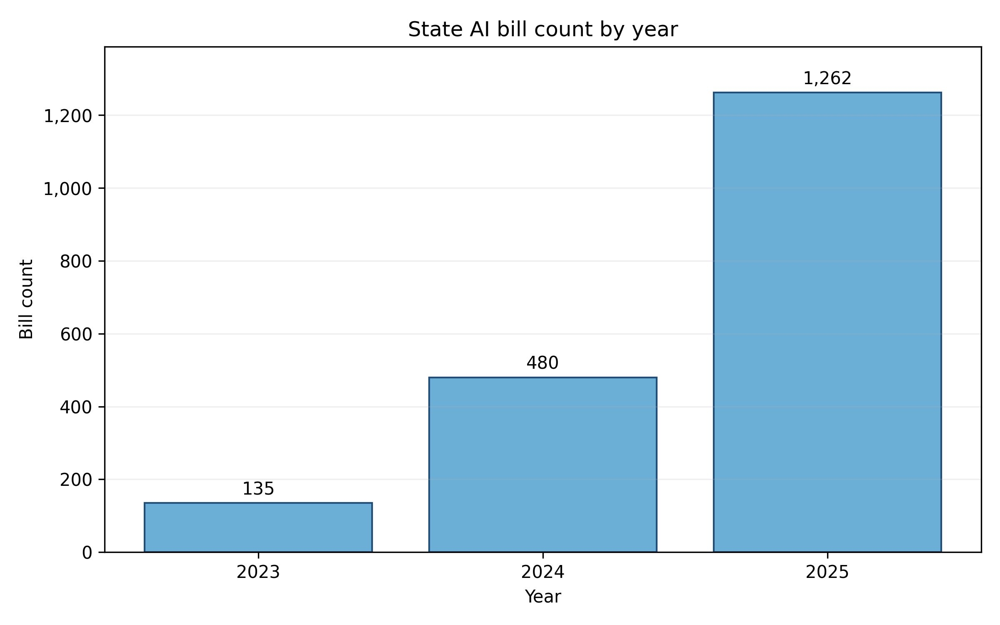

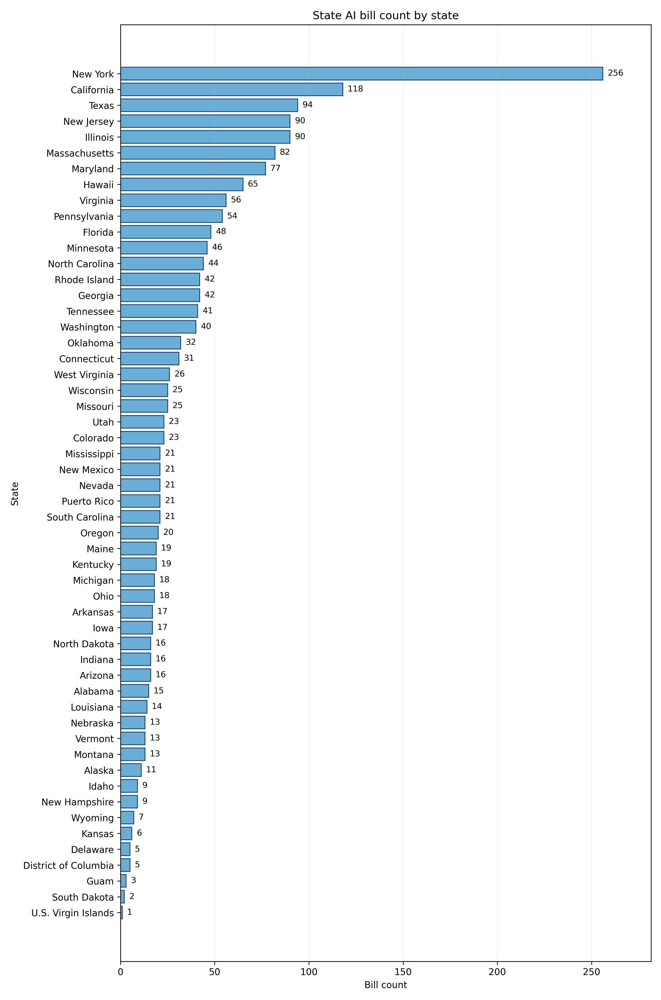

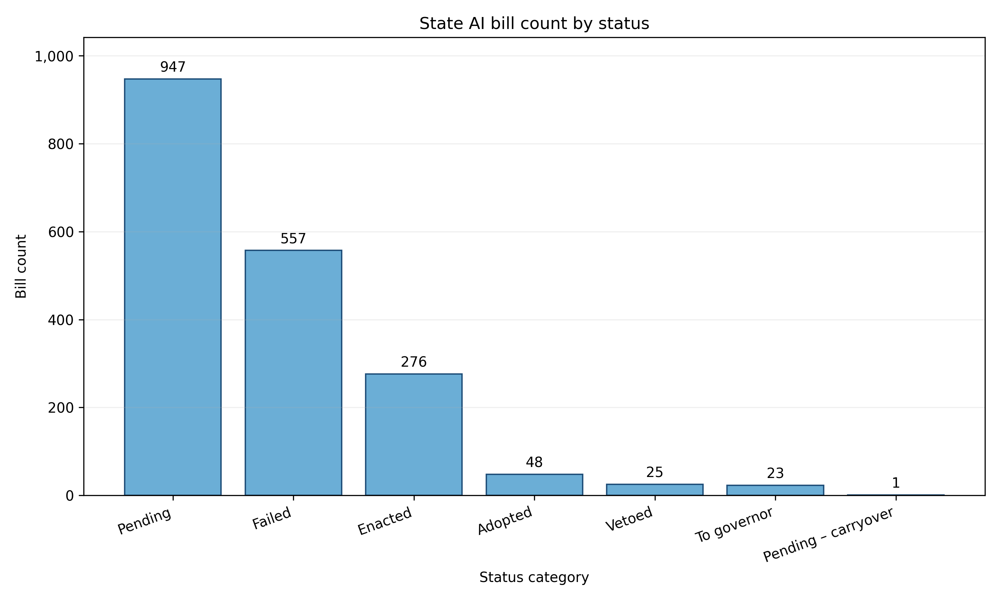

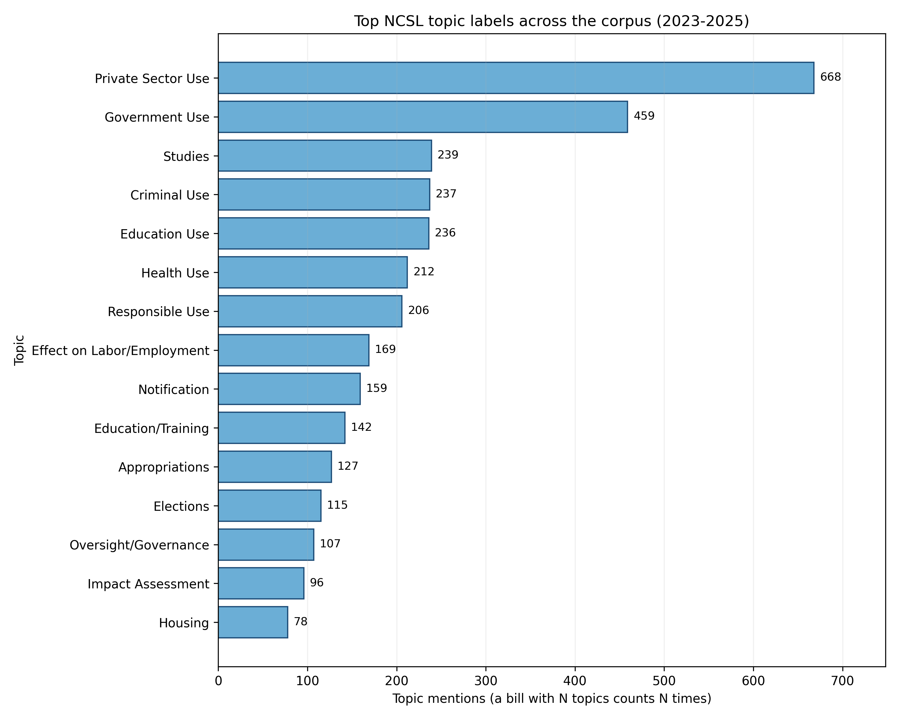

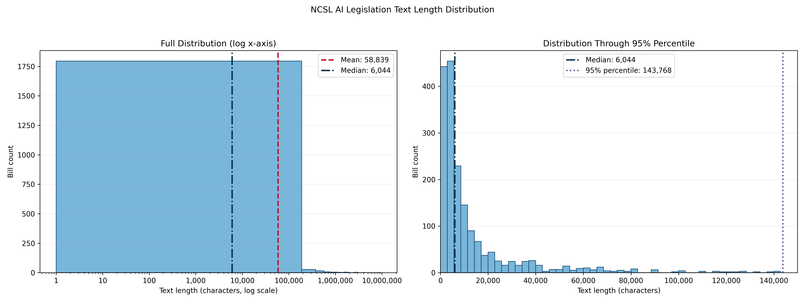

## Challenges in the Data

### Heterogeneity across jurisdictions

Drafting conventions, section numbering, and cross-references differ across the fifty states, and the same concept appears under different language, such as "automated decision system" in one bill, "AI system" in another, and "algorithmic tool" in a third. Fixed-pattern rule-based extraction cannot follow this variation, and the LLM methods handle it by reading the defining clause in context rather than matching a surface string.

### Target-entity vs regulatory mechanism ambiguity

The same bill can name an entity in one clause and then specify a mechanism that acts on that entity two clauses later, and a keyword method cannot tell which role a phrase is playing. The pipeline handles this by producing entity and attribute as two separate fields of the same quadruplet, each with its own evidence span, so the role each phrase plays is recoverable from the span and not just from the label.

### Keyword-based inclusion false positives

A bill can reach the corpus because a keyword filter matched one "artificial intelligence" string, while the body of the bill regulates something else entirely. The Rhode Island Clean Air Preservation Act \cite{ri2024s2540} is the concrete instance used in this paper. It reached the NCSL corpus through one definitions-section match, and the body regulates stratospheric aerosol injection and chemical and biological agents, where the word "agent" refers to a chemical agent rather than an AI agent. Both methods are affected by this corpus-inclusion bias, because both methods trust the corpus filter at intake; handling the false positive would require a relevance pre-check that is outside the extraction step.

# Results

The four LLM-judge tests defined in the Evaluation Design section structure this section. The first three rank the two extraction methods along accuracy, coverage, and head-to-head preference. The fourth bounds how much trust to place in the first three. A separate resource comparison ties cost to accuracy.

## Baseline vs Proposed Method

The two proposed methods are the multi-turn pipeline and the skill-driven agent, and both ran over the same corpus. NCSL's document-level labels \cite{ncsl2025ai} are the reference only at Test 2, because they carry a topic per bill and cannot enter the per-quadruplet or method-to-method layer. A rule-based pre-filter drops quadruplets whose required fields are empty, whose evidence spans are missing, or whose span text is not literally present in the bill; after this filter the multi-turn pipeline retains 10,429 of 10,876 quadruplets (95.89%) and the skill-driven agent retains 8,926 of 9,555 (93.42%). Only these surviving quadruplets enter the tests below.

### Per-quadruplet grounding (Test 1)

The first test asks the judge whether each surviving quadruplet is supported by the bill text. The multi-turn pipeline records 85.05% entailed, 11.55% neutral, and 3.39% contradicted. The skill-driven agent records 78.32% entailed, 18.07% neutral, and 3.61% contradicted. The contradiction rate, which is the most direct failure signal in this test, is indistinguishable across methods. The entailed-rate gap is confounded with volume, because the multi-turn pipeline was judged on 1,503 more quadruplets than the skill-driven agent. The separator in this test is the neutral rate, which is higher for the skill-driven agent, consistent with its tendency to paraphrase values; this also explains why every pre-filter failure on the skill-driven agent is of type span-not-literal (629 of 629) while the multi-turn pipeline's pre-filter failures are dominated by missing fields and missing spans.

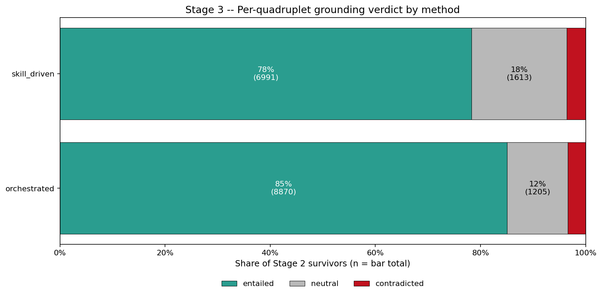

### Set-to-label coverage (Test 2)

The second test asks the judge whether, for each bill and each NCSL topic label on that bill, the method's surviving quadruplets jointly account for the label. On the permissive definition that counts both covered and partially covered, the skill-driven agent leads by 3.33 pp (87.04% vs 84.03%). On the strict definition that counts only covered, the skill-driven agent leads by 32.06 pp (81.50% vs 49.44%), and its error rate is roughly forty times smaller (0.03% vs 1.30%), driven by the multi-turn pipeline's longer supporting lists overflowing the judge prompt. Because NCSL topic labels are the reference for the downstream analyses below, the strict-coverage gap is the outcome-relevant number.

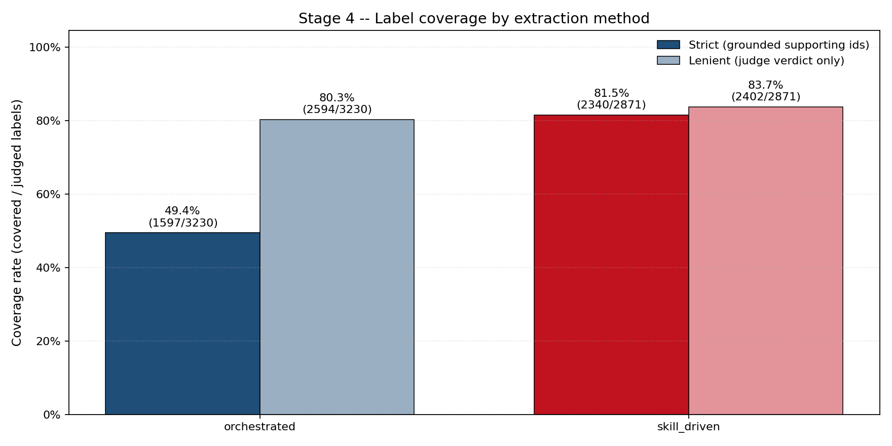

### Cross-method pairwise comparison (Test 3)

The third test shows the judge both methods' quadruplet sets for the same bill and asks it to pick one. Each of the 1,693 bills in the evaluation intersection is judged twice with presentation order swapped, so position bias is canceled by averaging \cite{zheng2023judging}. Both presentation orders prefer the skill-driven agent, with a swap-averaged win rate of 75.99% against 22.68% for the multi-turn pipeline. A count-normalised variant that adjusts for the fact that the multi-turn pipeline writes more quadruplets cuts the raw gap roughly in half, and the skill-driven agent still leads by 3.4× in normalised points (0.3791 vs 0.1126).

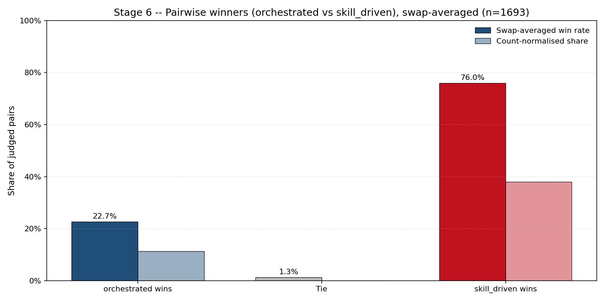

### Judge bias audit (Test 4)

The fourth test perturbs the coverage prompt on a pooled 100-row sample and measures how often the judge flips its verdict. Position flips 3%, verbosity flips 4%, self-preference flips 7%, and authority flips 14%. The first three are at or near the noise range for this kind of audit. Authority is the outlier; a 14% sensitivity to a prefix that claims a senior expert insists on a verdict means any prompt that carries authority-aligned language has to be treated as a rerun condition. Inspection of the frozen prompts confirms that neither the grounding prompt nor the coverage prompt carries authority cues, so the results above are not contaminated by this channel.

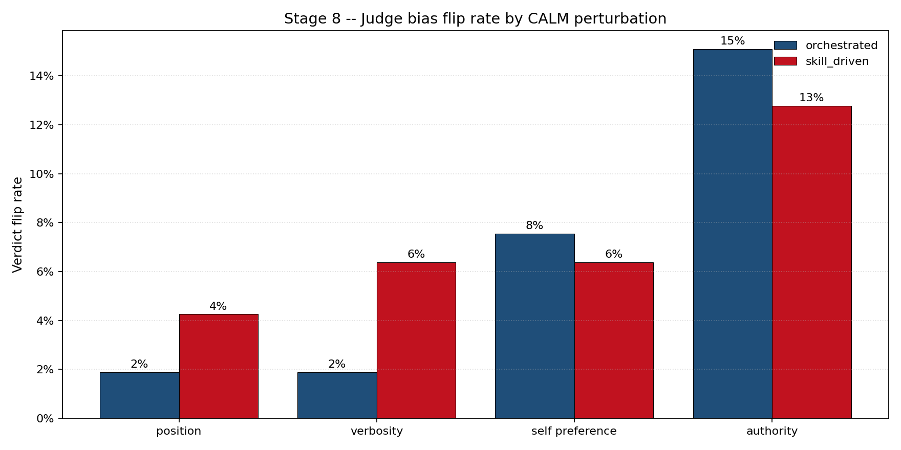

#### Discussion: skill-driven vs fixed-plan three-stage method vs theme and keyword labels

Of the three extractor-level tests, two separate the two methods and both point the same way. Set-to-label coverage puts the skill-driven agent 32.06 pp ahead on the strict definition, and cross-method pairwise comparison puts the skill-driven agent ahead 75.99% to 22.68% after swap-averaging. Per-quadruplet grounding does not separate the two methods on the contradiction signal. The judge diagnostic finds no trust failure on the prompts in use. Against NCSL's own document-level labels, both proposed methods produce granular entities and relations that the labels themselves cannot carry, so the label-level comparison is not a head-to-head but a statement that the proposed methods add a dimension the baseline does not have.

Under the audit of the grounded-but-uncited quadruplets, the multi-turn pipeline retains 6,319 entries and the skill-driven agent retains 1,730. The multi-turn pipeline's audit sample splits into bill-relevant specifics that NCSL's topic tags do not name and bill-adjacent entries that are off-topic relative to AI policy, such as tax credits, demonstrated-mastery assessments, and nuclear energy in bills that happen to mention AI. The skill-driven agent's audit entries are AI-topical by construction. The raw novelty count is therefore not promoted to a quality claim for the multi-turn pipeline; a sizable share of that advantage is extraction from the non-AI portions of bills that pass the keyword filter, which is the same mechanism that lowered the multi-turn pipeline's coverage rate.

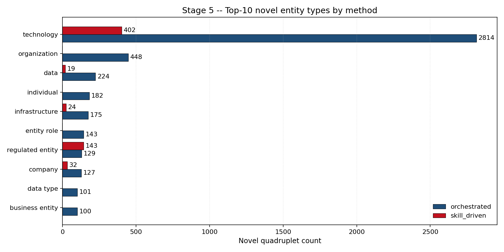

### Resource comparison

The multi-turn pipeline issued 21,586 LLM calls, 55.34 million tokens, at US\$228.78 over 27.4 cumulative hours of LLM time. The skill-driven agent issued 11,231 calls, 90.91 million tokens, at US\$315.60 over 16.2 hours. Normalized per bill across the corpus, the multi-turn pipeline averages 11.8 calls and US\$0.125 per bill, and the skill-driven agent averages 6.2 calls and US\$0.173 per bill. The skill-driven agent is cheaper in calls and time but more expensive in tokens and dollars, because each conversation carries the full running context across turns. The evaluation layer added US\$305.72 and 29,451 judge calls over 78.8 hours of cumulative judge time for the four tests combined.

#### Discussion: cost and accuracy comparison

The cost and accuracy axes point in opposite directions, which is the finding other researchers can carry. The multi-turn pipeline is cheaper in dollars but loses coverage and loses the pairwise preference. The skill-driven agent is more expensive in dollars but wins coverage decisively and wins the pairwise preference after swap-averaging. When the downstream use of the extraction is reference-aligned measurement against a fixed set of topic labels, the coverage gap is the axis that matters and the skill-driven agent is the pick. When the downstream use is broad exposure of bill-adjacent detail and price per bill is tight, the multi-turn pipeline has a place. The tokens-versus-calls split also matters for throughput: the skill-driven agent issues fewer calls but pays more per call, so rate limits and token budgets bind differently on the two designs.

## Live Demonstration

The live app is deployed at \url{https://ai-policy-qa.onrender.com}. Any reader can submit a bill URL, a bill identifier, or pasted text and receive the extracted quadruplets together with evidence spans. The same code path is exercised by a 100-question evaluation harness that scores the question-answering pipeline against hand-authored ground truth. The agentic version of the app passes 79 of 100 questions, against 54 for a single-pass RAG baseline and 59 for a self-query baseline, at a mean latency of 6.65 seconds. The deployment serves reproducibility on this paper, and invites other researchers to run the pipeline on new bills.

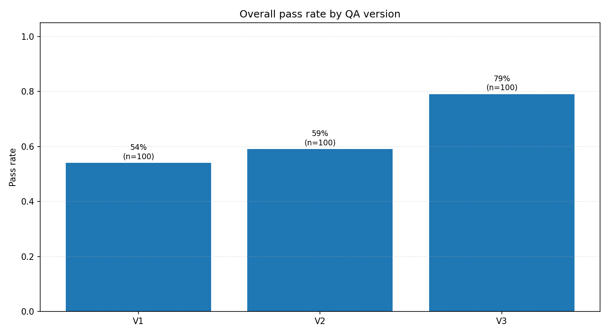

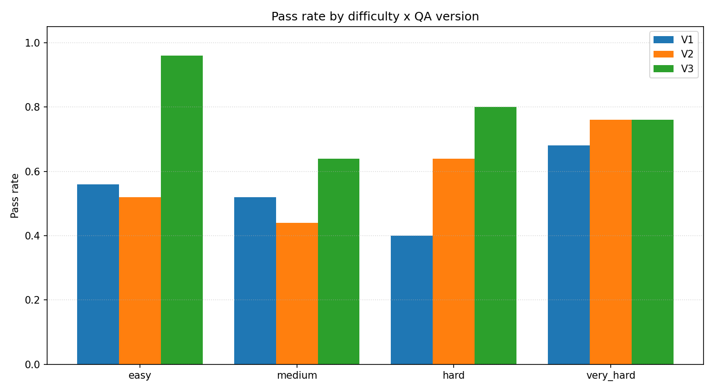

# Discussion

## Limitations

First, both proposed methods run on Claude Sonnet 4.5; a cross-family comparison is scoped for follow-up rather than included here. Second, the corpus is U.S. state AI legislation in English, so claims about the pipeline's portability to other jurisdictions or languages are method-level rather than empirical. Third, the demonstration app is hardwired to the corpus. In the future, we will release a version that can be configured to use other customized workflows on user provided corpora.

## Implications
