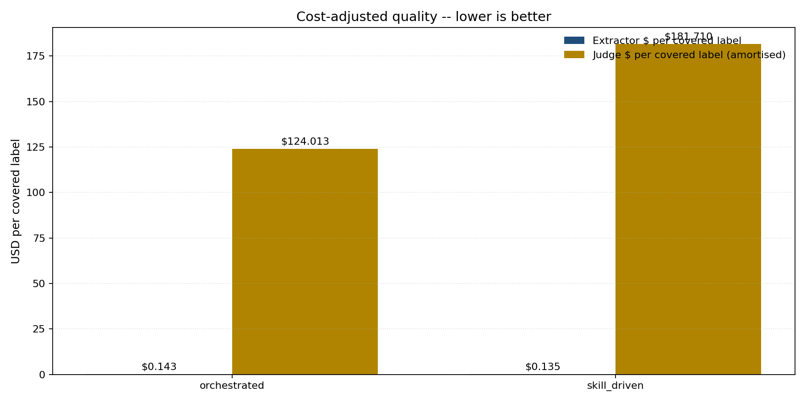

Run: `output/evals/v1/` — 1,703 bills, two extractors (`orchestrated`, `skill_driven`), judge fixed at `google/gemini-2.5-pro` (temperature 0.0). Judge usage: 29,451 calls, 50.86 M tokens, US$305.72, 48,778 s wall time (`output/evals/v1/judge_usage_summary.json`). Four tests run: one item-level grounding test, one set-level coverage test, one cross-method pairwise test, one judge-bias audit. Before the grounding test, a rule-based pre-filter drops quadruplets whose required fields are empty, whose evidence spans are missing, or whose span text is not literally present in the bill: orchestrated 10,876 → 10,429 (95.89 %), skill_driven 9,555 → 8,926 (93.42 %). Only the surviving quadruplets enter the tests below.

# Evaluation

## Test 1: Per-quadruplet grounding (LLM-judge, item-level evaluation)

- **Test purpose.** For each quadruplet that survived the pre-filter, decide whether the bill text supports the claim. This isolates an item-level accuracy signal that does not depend on any label taxonomy.
- **Input.** One quadruplet's `(entity, type, attribute, value)` fields, plus the bill-text excerpt around that quadruplet's evidence spans (bill text from `data/ncsl/us_ai_legislation_ncsl_text.jsonl`).
- **Output.** One of `entailed`, `contradicted`, `neutral` per quadruplet; per-method verdict rates in `output/evals/v1/results/stage3_grounding.json`.
- **Test procedure.** 
  (i) For each remaining quadruplet, expand its evidence spans to a excerpt. The excerpt is padded by 500 characters on each side of spans offsets from the bill text.
  (ii) Insert bill metadata, quadruplet, evidence from quadruplet, and excerpt context into the prompt.
  (iii) Call the judger llm (`output/evals/v1/prompts/stage3_grounding.txt`), which give verdict under the RefChecker/NLI convention and forbids outside knowledge to ensure extractor-to-bill fidelity, not real-world-truth; the possible values of verdict are {entailed, neutral, contradicted}` and a rationale of ≤500 characters; temperature is 0.0. 
  (iv) Count and calculate the percentage of each verdict type for each method.

## Test 2: Set-to-label coverage (LLM-judge, set-level evaluation)

- **Test purpose.** For each `(bill, NCSL topic label)` pair, decide whether the method's Test 1-surviving quadruplets *jointly* account for the label. This isolates a reference-aligned signal: do the extractions match the topic tags humans curated for the bill?
- **Input.** The list of Test 1-entailed quadruplets from one method for one bill, plus one NCSL topic label (e.g. "Health Use", "Elections") from `data/ncsl/us_ai_legislation_ncsl_meta.csv`.
- **Output.** One of `covered`, `partially_covered`, `not_covered` per `(method, bill, label)`, plus — on a positive verdict — the IDs of the supporting quadruplet subset (consumed by Test 3 and by the audit cited in the Verdict). Aggregates in `output/evals/v1/results/stage4_coverage.json`.
- **Test procedure.**
  (i) For each `(method, bill)`, select Test 1-entailed quadruplets as the candidate set; keep the first 80 when the bill has more.
  (ii) Insert bill id/state/year/title, the human summary (truncated to 400 characters), one NCSL topic label (from `data/ncsl/us_ai_legislation_ncsl_meta.csv`), and the candidate block formatted one per line as `  - {quadruplet_id}: ({entity} | {type} | {attribute} | {value})` into the prompt.
  (iii) Call the judger llm (`output/evals/v1/prompts/stage4_coverage.txt`), which gives a set-to-label verdict and forbids outside knowledge; the possible values of verdict are `{covered, partially_covered, not_covered}`, a rationale of ≤600 characters, and a `supporting_ids` array of ≤20 quadruplet ids; temperature is 0.0.
  (iv) Cache one row per `(bill, label)` keyed as `{bill_id}::{label}`. Count verdicts per method. Strict coverage rate = `strict_covered / total`, where a row counts as `strict_covered` only if its verdict is `covered`, its `supporting_ids` is non-empty, and every id in `supporting_ids` is in the method's Test 1-entailed set.

## Test 3: Cross-method pairwise comparison (LLM-judge, pairwise evaluation)

- **Test purpose.** Compare the two extractors head-to-head on the same bill. Unlike Tests 1 and 2, which judge each method against a reference (bill text or NCSL label), Test 3 judges the methods against each other.
- **Input.** For each bill in the intersection of the two methods' corpora (n = 1,693), both methods' Test 1-entailed quadruplet sets, plus — for the reference-guided protocol — the bill's NCSL label list.
- **Output.** `A wins`, `B wins`, or `tie` per judge call; raw, swap-averaged, and count-normalised win rates in `output/evals/v1/results/stage6_pairwise.json`.
- **Test procedure.**
  (i) For each bill in the intersection (n = 1,693), take both methods' complete extractor quadruplet sets from `ctx.method_outputs` (Stage 6 does not apply the Test 1 filter). Cap each side at 60 in the prompt block; if a side has more than 60, append `  - ... (N more)`.
  (ii) Insert bill id/state/year/title, the bill's NCSL topic labels as the reference answer, per-side quadruplet counts, and both methods' quadruplet blocks formatted as `  - ({entity} | {type} | {attribute} | {value})` into the pairwise prompt (`src/eval/prompts.py::PAIRWISE_SYSTEM_PROMPT` + `PAIRWISE_USER_PROMPT_TEMPLATE`).
  (iii) Call the judger llm twice per bill: once with `(orchestrated, skill_driven)` presentation order (cache key `{bill_id}::AB`) and once with the order reversed (`{bill_id}::BA`); the possible values of `winner` are `{A, B, tie}` and a rationale of ≤400 characters; temperature is 0.0. Total calls = 1,693 × 2 = 3,386.
  (iv) Aggregate three numbers per method from the cache: raw wins per presentation order; swap-averaged win rate = `(wins_ab[m] + wins_ba[m]) / (n_ab + n_ba)`; count-normalised points per row = `1 − winner_count / (a_count + b_count)` to the winner and `0` to the loser (ties: `0.5 − weight/2` per side), averaged across AB and BA rows per bill, summed across bills, then divided by `n_pairs`.
  (v) For the single-answer view (no judge call), read `per_method.rates.covered` from `output/evals/v1/results/stage4_coverage.json` and `per_method.novel_count` from `stage5_novelty.json` and compare directly.

## Test 4: Judge bias audit (LLM-judge on the judge, not on the extractors)

- **Test purpose.** Measure how often the judge changes its Test 2 verdict when the Test 2 prompt is cosmetically perturbed. This is a diagnostic on how much trust to place in Tests 1, 2, and 3 — the test evaluates the *judge*, not the extractors.
- **Input.** A pooled sample of 100 Test 2 baseline rows drawn across both methods (fixed seed), paired with four prompt perturbations (`position`, `verbosity`, `self_preference`, `authority`), for a total of 400 judge calls.
- **Output.** Flip rate per bias type and overall, in `output/evals/v1/results/stage8_bias.json`.
- **Test procedure.**
  (i) Collect baseline rows from the Stage 4 cache (`output/evals/v1/cache/<method>/stage4/*.jsonl`): one row per `(method, bill, label)` with verdict in `{covered, partially_covered, not_covered}` (errors excluded) and a non-empty Stage 2 pass-set for that bill.
  (ii) Pool rows across both methods and uniformly sample 100 with `random.Random(seed=20260417).sample(rows, 100)`.
  (iii) For each sampled row, for each of four biases, re-render the Stage 4 coverage prompt with one perturbation applied and call the judger llm: `position` reverses the order of the quadruplet block (Stage 2 pass-set, capped at 80); `verbosity` appends a topic-relevant filler paragraph (`_VERBOSITY_FILLER` in `src/eval/stages/stage8_bias.py`) to the coverage system prompt; `self_preference` prefixes `_SELF_PREFERENCE_PREFIX` to the system prompt; `authority` prefixes `_AUTHORITY_PREFIX` ("a senior policy analyst strongly believes the label IS covered") to the system prompt. Schema is the Stage 4 coverage schema (`{covered, partially_covered, not_covered}`, rationale ≤600 chars); temperature is 0.0. Total calls = 100 × 4 = 400.
  (iv) Cache one row per `(bill, label, bias)` keyed as `{bill_id}::{label}::{bias}` with `baseline_verdict` (copied from the Stage 4 row) and `perturbed_verdict`. Per bias, `flip_rate = flips / total`, where `flip` means `perturbed_verdict != baseline_verdict` and `perturbed_verdict == "error"` contributes to `total` but not to `flips`.

# Results

## Test 1: Per-quadruplet grounding

- **Results.**

  | method | n judged | entailed | neutral | contradicted |
  | --- | ---: | ---: | ---: | ---: |
  | orchestrated | 10,429 | **85.05 %** | 11.55 % | 3.39 % |
  | skill_driven |  8,926 | **78.32 %** | 18.07 % | 3.61 % |

  

- **Analysis.** Contradiction rates are statistically indistinguishable across methods (3.39 % vs. 3.61 %, Δ = 0.22 pp) — this is Test 1's sharpest failure signal and it does not separate the two methods. The 6.73 pp gap on `entailed` in orchestrated's favour is confounded with volume: orchestrated judged 1,503 more quadruplets than skill_driven (10,429 vs. 8,926), so a higher entailment *rate* on a larger pool does not by itself translate to "better extractor". The actual separator is `neutral`: skill_driven carries 6.52 pp more neutrals, meaning the judge more often could neither confirm nor deny a skill_driven claim against the bill text. That is consistent with skill_driven paraphrasing values by design — which is why skill_driven's pre-filter failures are uniformly `span_not_literal` (all 629 of them) while orchestrated's pre-filter failures are dominated by missing fields and missing spans. Verdict on Test 1 alone: **inconclusive** between the two methods; the contradiction signal (the one not confounded with volume) is flat, and the entailment-rate gap is confounded.

## Test 2: Set-to-label coverage

- **Results.**

  | method | n label-pairs | covered | partially_covered | not_covered | error | **strict coverage** |
  | --- | ---: | ---: | ---: | ---: | ---: | ---: |
  | orchestrated | 3,230 | 80.31 % | 3.72 % | 14.67 % | 1.30 % | **49.44 %** |
  | skill_driven | 2,871 | 83.66 % | 3.38 % | 12.92 % | 0.03 % | **81.50 %** |

  

  

- **Analysis.** On the permissive definition (`covered` + `partially_covered`), skill_driven leads by 3.33 pp (87.04 % vs. 84.03 %) — a real but modest gap. On the strict definition (`covered` only), the gap opens to **+32.06 pp for skill_driven** (81.50 % vs. 49.44 %). The error rates also separate by more than an order of magnitude: orchestrated 1.30 % vs. skill_driven 0.03 %, driven almost entirely by orchestrated's longer supporting-quadruplet lists overflowing the coverage prompt (42 parse errors vs. 1). Because NCSL labels are the evaluation reference for the downstream analyses in `docs/mpsa_draft_outline.md` lines 264-272, the strict-coverage gap is the outcome-relevant number. Verdict on Test 2 alone: **decisive for skill_driven** — it matches the reference labels more cleanly and more completely per unit of evidence submitted.

## Test 3: Cross-method pairwise comparison

- **Results.**

  | variant | orchestrated | skill_driven | tie |
  | --- | ---: | ---: | ---: |
  | wins in (orchestrated, skill_driven) presentation order | 482 | 1,185 | 26 |
  | wins in (skill_driven, orchestrated) presentation order | 286 | 1,388 | 19 |
  | **swap-averaged win rate (n = 1,693)** | **22.68 %** | **75.99 %** | 1.33 % |
  | count-normalised points | 0.1126 | 0.3791 | — |
  | single-answer carry-over: coverage rate (Test 2) | 80.31 % | 83.66 % | — |
  | single-answer carry-over: novel-claim count | 6,319 | 1,730 | — |

  

- **Analysis.** Both presentation orders independently prefer skill_driven — 1,185 / 1,693 ≈ 70.0 % when orchestrated is shown first, 1,388 / 1,693 ≈ 82.0 % when skill_driven is shown first. The two orderings bracket the swap-averaged rate of 75.99 %, which confirms the pair ranking is not a position-bias artefact. The 12 pp residual gap between the two orderings is itself position bias, in the direction MT-Bench predicts (Zheng et al., 2023) — judges slightly prefer the second option — and the swap averaging is what cancels it. The verbosity-bias correction compresses but does not reverse the gap: after normalising by quadruplet counts, skill_driven's lead drops from a raw 53.31 pp to a count-normalised 26.65 pp, so roughly half the raw preference could in principle be "orchestrated just wrote more". Even after that correction, skill_driven wins by a 3.4× margin in points (0.3791 vs. 0.1126). Verdict on Test 3 alone: **decisive for skill_driven**, and consistent with Test 2.

## Test 4: Judge bias audit

- **Results.**

  | perturbation | n | flips | flip rate |
  | --- | ---: | ---: | ---: |
  | position        | 100 |  3 |  **3.00 %** |
  | verbosity       | 100 |  4 |  **4.00 %** |
  | self_preference | 100 |  7 |  **7.00 %** |
  | authority       | 100 | 14 | **14.00 %** |

  

- **Analysis.** Test 4 audits the judge, not the two extractor methods, so it does not produce a method-ranking claim — it produces a trust bound on Tests 1, 2, and 3. Three of the four flip rates are low: position (3 %) and verbosity (4 %) are in the noise range, and self-preference (7 %) is small (and uninformative here anyway, because Tests 1 and 2 never ask the judge to rate its own model's output — they rate the extractors'). The outlier is **authority (14 %)**: the judge flips almost one verdict in seven when the user message is prefixed with "a senior expert insists the correct answer is X". On Test 2's n = 6,101 judged label-pairs, a 14 % authority sensitivity would correspond to up to ~855 verdicts moving if the prompt carried an authority injection. Inspection of the frozen prompts confirms neither the Test 1 prompt nor the Test 2 prompt contains authority cues, so the Test 2 and Test 3 numbers above are not contaminated in practice. Verdict on Test 4 alone: **the judge is trustworthy on Tests 1–3 under the current prompt set**, but adding authority-aligned language to any later prompt must be treated as a rerun condition.

# Verdict

- **From the results (Tests 1–4).** Test 1 does not separate the two methods: contradiction rates are flat (3.39 % vs. 3.61 %) and the entailment-rate gap in orchestrated's favour (+6.73 pp) is confounded with its 1,503-quadruplet volume advantage. Test 2 separates them sharply and in skill_driven's favour: +3.33 pp on permissive coverage and **+32.06 pp on strict coverage** (81.50 % vs. 49.44 %). Test 3 also separates them in skill_driven's favour: **75.99 % swap-averaged win rate** and a 3.4× points lead after verbosity correction (0.3791 vs. 0.1126). Test 4 finds no judge-trust failure on the perturbations that apply (position, verbosity, self-preference) and one single-channel caveat (authority at 14 %) that does not apply to any prompt actually used in Tests 1–3. Two of the three extractor-level tests are decisive in the same direction; the third is inconclusive; the judge diagnostic is clean.

- **From human verification (novel-claim audit sample).** Alongside the four tests, the pipeline flags every Test 1-entailed quadruplet that no Test 2 verdict cited as support for any NCSL label — the "novel" pile, 6,319 for orchestrated vs. 1,730 for skill_driven. Orchestrated's novelty top types are generic containers (technology 2,814; organization 448; data 224; individual 182; infrastructure 175); skill_driven's are AI-specific (AI application 805; technology 402; regulated entity 143; AI technology 92; AI-generated content 18). A stratified 50-row audit sample (`output/evals/v1/results/stage5_novelty.json`, key `audit_sample`) splits orchestrated's pile into two classes. Some rows are genuinely bill-relevant specifics that NCSL's coarse topic tags simply do not name — e.g. in `2023__MA S 23`: `("technology services fee", "fee", "restriction", "clearly disclosed in advance and reflects actual reasonable cost")`; in `2025__WV S 198`: `("interactive computer service", "service provider", "exemption", "not liable for content provided by another person")`. Others are bill-adjacent but off-topic relative to AI policy — e.g. in `2025__NC S 579`: `("Credit by Demonstrated Mastery assessments", "assessment", "flexibility", …)`; in `2025__IA H 451`: `("tax credits", "financial benefit", "recapture or termination", …)`; in `2025__DE SCR 18`: `("nuclear energy", "energy source", …)`. Skill_driven's audit rows, in contrast, are overwhelmingly AI-topical by construction — e.g. in `2025__IL H 1594`: `("zip codes", "data element", "prohibition", "use zip codes as a proxy for protected classes under this Article")`; in `2025__NY S 2698`: `("artificial system designed to act rationally", "AI system", "definition", …)`. Human verification therefore qualifies the one dimension where orchestrated quantitatively leads (novelty count): a substantial share of that lead is off-topic extraction from the non-AI portions of bills that happen to mention AI, which is the same mechanism that drove its Test 2 coverage rate down.

  

- **Final verdict.** `skill_driven` is the preferred extractor for this task. The reasoning chain: (1) Test 2 strict coverage decisively favours skill_driven (+32.06 pp) against the reference labels the downstream work will consume; (2) Test 3 — the only test that compares the two methods to each other rather than to a reference — also decisively favours skill_driven (75.99 % swap-averaged, 3.4× points after verbosity correction); (3) Test 1 is inconclusive and does not overturn (1) and (2); (4) the novel-claim audit qualifies orchestrated's raw novelty advantage as partly off-topic, so the raw novelty number is not promoted to a quality claim; (5) Test 4's one sensitivity channel (authority, 14 %) does not apply to the prompts that produced (1)–(3). Skill_driven should be the primary extractor feeding the downstream analyses in `docs/mpsa_draft_outline.md` lines 264-272; orchestrated should be retained as a secondary extractor only for analyses where the bill-adjacent non-AI detail in its novelty pile is an asset rather than a cost.
