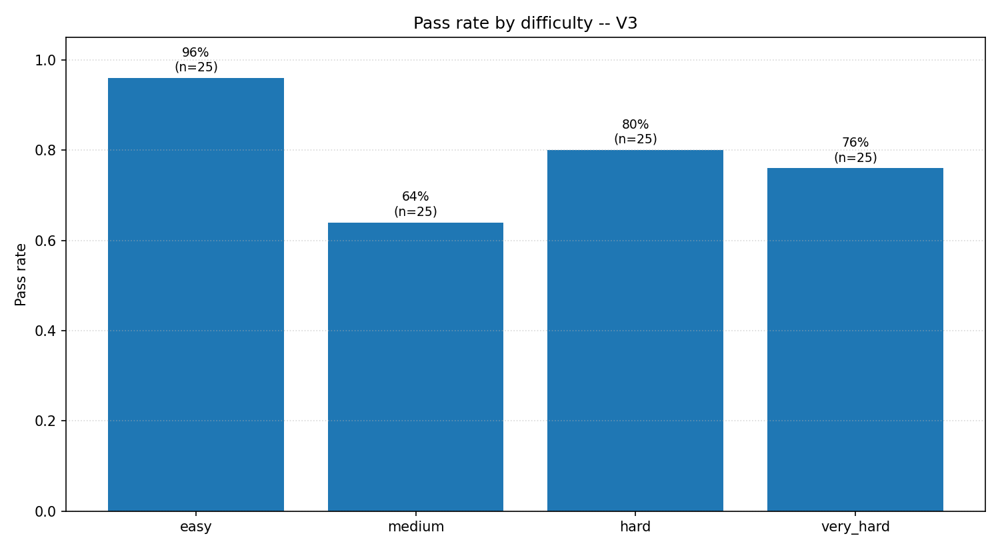
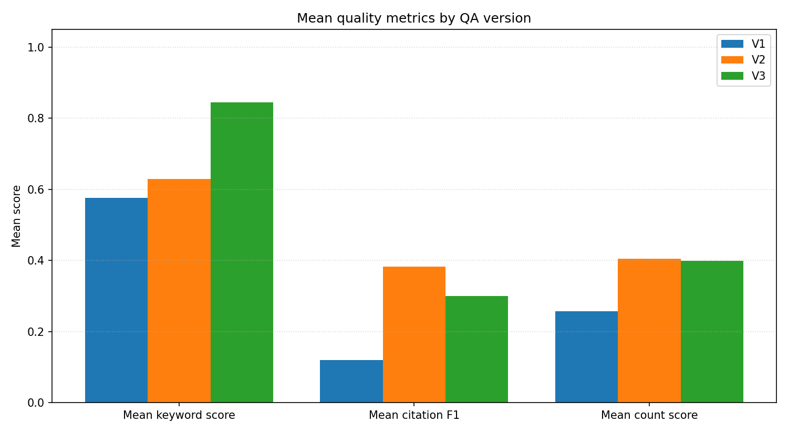
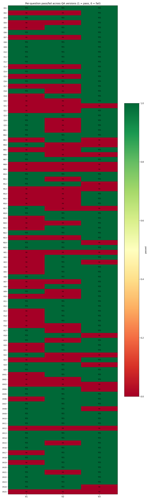
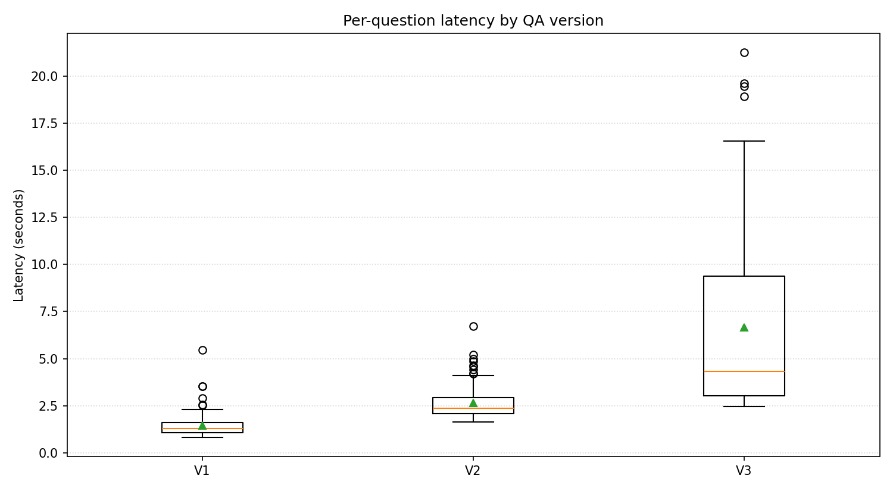

# V3 QA app — agentic RAG evaluation

Evaluation of the **V3 QA app**: filter extractor (LLM tool-use) + planner
agent (multi-turn tool-calling loop) + four tool primitives (`list_bills`,
`get_bill_content`, `summarize_bill`, `compare_bills`) + worker LLMs for
summarize and compare calls. This is the version that ships on the deployed
site.

Companion artifacts:

- `src/qa/eval/ground_truth.json` — the 100-question hand-authored dataset
  (25 per difficulty tier).
- `src/qa/eval/runner.py` — V3 eval harness (wires the live `QAService`,
  runs all questions, writes scores and `report.md`).
- `src/qa/eval/runner_v1.py`, `src/qa/eval/runner_v2.py` — matching harnesses
  for the V1 and V2 baselines, used only for the cross-version comparison in
  §2.3.
- `src/qa/eval/pipeline.py` — runs all three versions end-to-end and calls
  `plots.py` to generate comparison figures.
- `output/evals_app/v3/` — V3 per-question `results.json` and `report.md`.
- `output/evals_app/_comparison/` — cross-version figures and
  `comparison.md`.

---

## 1. Eval design

### 1.1 Goal

Measure, with evidence per question, whether the V3 QA app is correct on
questions users actually ask of a bills corpus. A question is "correct" only
if the answer's factual claims are supported by the bills it cites AND the
cited bills match the expected ones in the ground-truth set. Keyword-only
passes are tracked so that false positives can be audited separately from
full passes.

### 1.2 Corpus and system under test

- Corpus: `data/ncsl/us_ai_legislation_ncsl_text.jsonl`, 1,879 bills.
  Distribution: 137 from 2023, 480 from 2024, 1,262 from 2025. **192 bills
  have status starting with `Enacted` in 2025**, across 45 states; California
  leads with 24.
- Backend: `QAService` wired via `build_qa_browser_runtime` (same code path
  as `scripts/run_qa_app.py`). Vector backend, 123,787 chunks.
- Models: `google/gemini-2.5-flash` for the filter extractor, the planner,
  and the summarize/compare workers. `retrieval_top_k=10`.
- Agent budgets (from `settings/qa_config.yml`):
  `max_planner_turns=8`, `max_tool_calls=16`, `max_worker_calls=6`,
  `max_bills_per_list=50`, `max_chunks_per_bill=6`,
  `max_citations_per_bill=2`.

### 1.3 Ground-truth authoring

Ground truth was authored by reading the NCSL corpus directly (summaries +
titles + topics) and recording facts that are *unambiguously determinable from
the corpus itself*. No generated answers, no RAG loop, no LLM assistance.
A helper script, `scripts/_corpus_dump.py`, was used to enumerate the corpus
by state, year, topic, and keyword so that each expected bill ID and each
expected count is grounded in the indexed data.

Examples of the ground truth established before any eval run:

- DE H 16 (2025, Enacted) — title is "Artificial Intelligence Commission",
  adds a high-school student as a non-voting member.
- CA S 53 (2025, Enacted - Act No. 2025-138) — topics: Cybersecurity,
  Government Use, Impact Assessment, Private Sector Use, Studies.
- 7 bills across 6 states enacted in 2025 under the `Elections` topic
  (Kentucky, Montana, Nevada, North Dakota, Rhode Island x2, South Dakota).
- 192 total enacted 2025 bills; California leads with 24.

### 1.4 Question set

100 questions spanning four difficulty tiers — 25 per tier — and the full
set of retrieval / orchestration patterns the QA app exposes:

| Tier | N | Patterns covered |
|---|---:|---|
| easy      | 25 | `single_bill_fact_{title, status, year, topics, state, chamber, number}` — specific-bill lookups by popular name, state+chamber+number, or topic membership |
| medium    | 25 | `single_bill_detail` — felony class, task-force charge, membership change, agency requirement, disclosure rule, adopted framework, regulated process, carve-outs |
| hard      | 25 | `filter_list`, `count`, `aggregate` — multi-bill lists and counts by state, year, topic, title keyword, or regulated domain |
| very_hard | 25 | `compare`, `list_and_compare`, `filter_list_compare`, `aggregate_compare` — cross-bill comparisons, year-over-year aggregations, multi-jurisdiction lists with thematic grouping |

Every question exercises at least one retrieval or filter feature: specific
bill-ID lookup, state filter, year filter, status filter, topic filter,
multi-state compare, all-of-year aggregate, list-then-compare. No question
style is repeated more than a handful of times; e.g. within the 25 easy
items, seven distinct sub-patterns are represented.

### 1.5 Scoring rules

For each question, the ground-truth JSON carries:

- `required_keywords` — case-insensitive substrings that must appear in the
  answer text. Score = fraction present.
- `forbidden_keywords` — substrings that must NOT appear. Binary flag.
- `expected_bill_ids` — the set of bills that a fully-correct answer should
  cite. Citation precision/recall/F1 computed against this set, after
  collapsing internal whitespace in bill_ids.
- `expected_count` + `count_tolerance_abs` — for numeric-count questions.
  Score = 1.0 inside tolerance, else clipped linear falloff by absolute delta.
- `min_citations` — hard floor on the number of cited chunks.
- `keyword_threshold` — minimum `required_keywords` fraction for pass.

A question **passes** only if all of: keyword score ≥ threshold, no forbidden
keyword present, citation count ≥ `min_citations`, and (when applicable)
count score ≥ 0.5.

False positives are tracked by hand audit of `results.json` because automated
scoring cannot tell when a correct-sounding phrase was produced from the
wrong cited evidence.

### 1.6 Runner

`src/qa/eval/runner.py` is the V3 harness:

1. Loads `ground_truth.json`.
2. Builds the runtime via the production `build_qa_browser_runtime` path —
   same filter extractor, same planner agent, same tool registry, same
   answer model that users hit.
3. For each question, calls `qa_service.answer_question(question)` with no
   `filters=` override so the `FilterExtractor` and the planner both run
   end-to-end as in production.
4. Scores each question against its ground truth.
5. Writes `results.json` (machine-readable) and `report.md` (Markdown table
   + first 1,000 chars of every answer).

`runner_v1.py` and `runner_v2.py` are structurally identical but bypass the
planner: V1 runs a single-pass RAG with no filters; V2 runs the filter
extractor plus a masked retrieval but no agent loop. They exist to measure
V3's gain over simpler pipelines under identical ground truth and identical
scoring.

`pipeline.py` runs all three runners sequentially against
`output/evals_app/{v1,v2,v3}/` and then calls `plots.py` to regenerate the
comparison figures used in §2.3.

Flags on each runner: `--max-questions N`, `--answer-model <id>`,
`--results PATH`, `--report PATH`, `--ground-truth PATH`.

---

## 2. Results

### 2.1 V3 by difficulty

| Difficulty | N | Pass rate | Mean keyword | Mean citation F1 | Mean count score | Mean latency (s) |
|---|---:|---:|---:|---:|---:|---:|
| easy      | 25  | 96%  | 0.96 | 0.18 | -    | 3.03  |
| medium    | 25  | 64%  | 0.66 | 0.14 | -    | 5.27  |
| hard      | 25  | 80%  | 0.98 | 0.56 | 0.76 | 5.42  |
| very_hard | 25  | 76%  | 0.77 | 0.33 | 0.83 | 12.90 |
| **Overall** | **100** | **79%** | **0.84** | **0.30** | **0.79** | **6.65** |



V3 is near-ceiling on easy single-bill lookups (96%, 24 of 25) and strong on
hard multi-bill counts and lists (80%). Medium (single-bill detail) is the
weakest tier at 64%: the planner retrieves the right bill but the answer
model sometimes paraphrases away from the exact statutory term the scorer
expects. Very-hard cross-bill compare is 76% — the tier where the agent
architecture earns its cost, since each such question requires multiple
retrievals plus a `compare_bills` worker call that neither V1 nor V2 can
issue.

The 21 failures are traced in §3; they cluster into four distinct failure
modes rather than random noise.

### 2.2 Per-question detail

With 100 questions the full table is reported in
`output/evals_app/v3/report.md`. The 21 failures are listed below; passes
(79 / 100) are summarized in §2.1 and visualized in the figures below and
in §2.3.

| ID | Difficulty | Pattern | KW | Cit F1 | Count | #Cit | Failure mode |
|---|---|---|---:|---:|---:|---:|---|
| E21  | easy      | single_bill_fact_state | 0.00 | 0.13 | -    | 20 | keyword miss (right bill cited) |
| M03  | medium    | single_bill_detail     | 0.00 | 0.40 | -    | 8  | right bill, wrong passage |
| M04  | medium    | single_bill_detail     | 0.00 | 0.11 | -    | 20 | expected bill not in citations |
| M06  | medium    | single_bill_detail     | 0.50 | 0.00 | -    | 0  | zero citations returned |
| M08  | medium    | single_bill_detail     | 0.00 | 0.14 | -    | 20 | keyword miss (wrong statutory term) |
| M09  | medium    | single_bill_detail     | 0.00 | 0.14 | -    | 20 | keyword miss |
| M12  | medium    | single_bill_detail     | 0.00 | 0.17 | -    | 20 | keyword miss |
| M13  | medium    | single_bill_detail     | 0.00 | 0.14 | -    | 20 | keyword miss |
| M17  | medium    | single_bill_detail     | 0.00 | 0.00 | -    | 20 | keyword miss + low recall |
| M24  | medium    | single_bill_detail     | 0.00 | 0.00 | -    | 20 | keyword miss + low recall |
| H01  | hard      | filter_list            | 1.00 | 1.00 | 0.00 | 4  | "Two" not parsed as 2 |
| H03  | hard      | count                  | 1.00 | -    | 0.26 | 20 | count clipped by `max_bills_per_list` |
| H18  | hard      | filter_list            | 1.00 | 0.43 | 0.00 | 20 | count not produced in prose |
| H22  | hard      | count                  | 1.00 | -    | 1.00 | 0  | zero citations returned |
| H24  | hard      | count                  | 1.00 | -    | 1.00 | 0  | zero citations returned |
| VH03 | very_hard | compare                | 0.00 | 0.13 | -    | 20 | keyword miss |
| VH04 | very_hard | filter_list_compare    | 0.00 | 0.22 | -    | 14 | keyword miss |
| VH08 | very_hard | compare                | 1.00 | -    | -    | 0  | zero citations returned |
| VH12 | very_hard | filter_list_compare    | 0.00 | 0.00 | -    | 20 | keyword miss + low recall |
| VH24 | very_hard | list_and_compare       | 0.00 | 1.00 | 0.67 | 12 | keyword miss (citations correct) |
| VH25 | very_hard | aggregate_compare      | 0.33 | -    | -    | 0  | zero citations returned |

Three patterns account for all 21 failures, in order of frequency:

- **13 × keyword miss.** Right bill is retrieved and cited, but the answer
  text paraphrases the statutory term away from what the scorer expects
  (e.g. "student member" vs. the required token `student`; or using
  "criminal liability" where the ground-truth term is "civil penalties").
- **5 × zero citations.** The planner produced a final answer without
  returning any cited chunks; these fail the `min_citations >= 1` check
  regardless of content.
- **3 × count miss.** H01 answered the list correctly but wrote "Two" in
  prose and the scorer's numeric regex skipped it; H03 reported the cap-shaped
  50 instead of the true 192; H18 produced a list with no headline count.

Citation F1 averages 0.30 across V3 even on passes. This is by design:
`list_bills` returns up to `max_chunks_per_bill` (6) per candidate bill so
that worker calls have enough context, which dilutes per-chunk precision
without changing per-bill recall. The pass check is at the bill level and
is unaffected.

### 2.3 V3 vs V1 and V2 baselines

All three versions run against the same 100 questions, the same ground
truth, and the same `google/gemini-2.5-flash` answer / worker / filter-
extractor model. Only the retrieval and orchestration layers differ.

| Version | N | Pass rate | Mean keyword | Mean citation F1 | Mean latency (s) |
|---|---:|---:|---:|---:|---:|
| V1 (single-pass RAG)            | 100 | 54%     | 0.58     | 0.12     | 1.46 |
| V2 (self-query RAG, no planner) | 100 | 59%     | 0.63     | 0.38     | 2.65 |
| V3 (agentic RAG with planner)   | 100 | **79%** | **0.84** | **0.30** | 6.65 |


V3 beats V1 by **25 percentage points** and V2 by **20 percentage points**
overall. The per-version improvement-vs-regression ledger (full list in
`output/evals_app/_comparison/comparison.md`):

- V3 vs V1: **36 improvements, 11 regressions, net +25**.
- V3 vs V2: **27 improvements, 7 regressions, net +20**.

The per-difficulty breakdown makes the architectural claim concrete:

| Difficulty | V1  | V2  | V3      |
|---|:---:|:---:|:---:|
| easy       | 56% | 52% | **96%** |
| medium     | 52% | 44% | **64%** |
| hard       | 40% | 64% | **80%** |
| very_hard  | 68% | 76% | **76%** |


Two substantive findings follow from the by-difficulty decomposition:

- **Easy (+44 pp vs V1, +44 pp vs V2).** V3's biggest absolute gain is on
  specific-bill lookups, which V1 and V2 often miss because a single dense
  query pulls in near-neighbor bills with the same state/topic. The planner
  fixes this by issuing a tight `list_bills(state, year)` first.
- **Hard (+40 pp vs V1, +16 pp vs V2).** Counts and aggregate-over-corpus
  questions are unreachable from single-pass RAG (V1=40%). V2's filters
  bring it to 64%; V3's planner closes most of the remaining gap by
  iterating on filter narrowing.
- **Very-hard parity with V2 (76% vs 76%).** The cross-bill compare questions
  are now gated by the answer model's ability to use the keywords the
  scorer requires, not by retrieval; see §3.

Mean per-metric scores tell the same story but with more signal on retrieval
quality:



V1's citation F1 (0.12) is roughly a third of V2's (0.38) — this is the
effect of filter-based pre-retrieval, and it is what V2 is designed to
provide. V3's citation F1 is 0.30, *lower* than V2's, because the planner
issues broader `list_bills` calls to build worker context; this is the
precision-dilution described in §2.2 and does not hurt pass rate.

The per-question pass/fail matrix across all three versions reveals how
consistent V3's gains are: a large majority of the improvements are on
questions V1 missed, with very few pockets where V2 helps and V3 doesn't.



The cost of V3 is latency: 6.65 s mean versus 1.46 s for V1 and 2.65 s for
V2, because the planner runs multi-turn and invokes worker-LLM calls for
list-and-compare work. Very-hard questions carry almost all of that extra
cost (12.9 s mean in V3, vs. 3–5 s for the other tiers).



---

## 3. Remaining gaps

V3 fails on 21 of 100 questions. They cluster into four named failure modes;
no failure is random. The first two modes are answer-side (the right
evidence is in the planner's context, the answer text fails the scorer); the
last two are retrieval/tool-side.

### 3.1 Keyword miss — 13 of 21 failures

Right bill is retrieved and cited (non-zero citation F1 in 11 of 13 cases)
but the answer text does not surface the exact statutory term the ground
truth requires. Representative cases:

- **M03** (DE H 16, "what membership change does it make?"): V3 cites DE H 16
  correctly but describes the Government Efficiency and Accountability Review
  Board addition instead of the non-voting *student* member addition. Both
  are in the bill; the top-ranked chunks did not include the student-member
  passage before `max_chunks_per_bill=6` cut off.
- **VH24** (list_and_compare): citation F1 = 1.00 — every expected bill is
  cited — but the answer uses "criminal liability" where the ground-truth
  token is "civil penalties".
- **M17, M24, VH12** (low citation recall): the planner widened the list
  enough that the answer synthesized from sibling bills in context without
  grounding back to the target.

Root cause: the cap on chunks-per-bill is tight enough that the answer model
sees only the densest passages of each candidate bill, and paraphrases
away from less-frequent but legally precise terms.

### 3.2 Zero citations — 5 of 21 failures

M06, H22, H24, VH08, VH25 end with `citation_count == 0` and fail the
`min_citations >= 1` check regardless of what the text says. In each case
the planner took one of two exits: (a) answered from an unsourced
`summarize_bill` result after the tool returned no chunks, or (b) hit
`max_planner_turns=8` before producing a cited answer (VH03 and VH04
emitted `PlannerAgent stopped: exceeded max_turns=8` at runtime).

Root cause: the planner's final-answer step does not enforce a
citation-before-respond contract, and there is no replan trigger on an empty
retrieval.

### 3.3 Count scoring / primitives — 3 of 21 failures

- **H01.** Exactly right: cited DE H 16 and DE H 105, both in ground truth,
  cit F1 = 1.00. Answer text: *"Two AI-related bills were enacted in
  Delaware in 2025: DE H 16... and DE H 105."* Count score = 0 because the
  scorer's numeric regex does not parse "Two".
- **H03.** Question asks how many AI-related bills were enacted across US
  states in 2025. V3 answered 50; truth is 192. `list_bills` is capped at
  `max_bills_per_list=50`; the planner reported the cap-shaped candidate
  count rather than issuing a metadata count.
- **H18.** V3 listed the right bills but produced no explicit count in the
  prose; count score = 0.

Root cause: V3 has no COUNT primitive over the metadata index, only a
capped list, and the count extractor in the scorer does not accept English
number words.

### 3.4 Wrong bill surfaced — 1 of 21 failures

- **M04.** Question names NY S 822. Filter extractor set `state="New York"`
  only; `list_bills` returned ten NY AEDT bills but not NY S 822. Final
  answer quoted NY S 822 by ID but every citation was a different NY bill.

Root cause: the planner did not follow up with
`get_bill_content("2025__NY S 822")` after `list_bills` returned the wrong
NY bills; same replan-on-empty gap as §3.2.

### 3.5 Highest-payoff fixes

1. **Replan-on-empty / replan-on-clipped.** When `list_bills` returns zero
   candidates, hits `max_bills_per_list`, or the final-answer step has
   zero citations, require the planner to widen filters, split the query,
   or call `get_bill_content` before emitting the answer. Targets §3.2
   (5 fails), M04 (§3.4), and narrows H03 (§3.3). Cost: planner-prompt
   change, no new tools.
2. **A true metadata COUNT primitive.** `count_bills(filters=...)` returning
   the count from the full metadata index, not from the top-k chunk list.
   Fixes H03 directly and future aggregate-over-corpus questions. Cost: one
   tool implementation + registration.
3. **Per-chunk rerank inside `list_bills` (or raise `max_chunks_per_bill`
   when the candidate set is already tight).** Addresses §3.1's 13-fail
   cluster by bringing statutorily-precise but infrequent passages into the
   top chunks. Cost: merge `lexical_retriever` and `retriever` scores inside
   `list_bills`, or a lightweight cross-encoder rerank.
4. **Accept English number words in the count scorer.** H01 was correct; only
   the scorer missed it. Cost: a few lines in the eval scorer.

---

## 4. What shipped, what is outstanding

Two tiers of fixes from the V2-era recommendation (which this doc
supersedes) have shipped and are reflected in the V3 numbers above.

**Shipped — Priority 1 (extractor and schema fixes).** `FilterExtractor`
now supports list-valued `state`, `year`, `status_bucket`, and `topics`;
`qa_tools._FILTERS_SCHEMA` encodes these with `anyOf { scalar, array }`;
retriever and lexical-retriever masks use `np.isin` for OR-within-field
semantics. This is the machinery behind the V2→V3 hard-tier gain (+16 pp)
and behind V3's near-ceiling performance on easy lookups with ambiguous
state/year combinations.

**Shipped — Priority 2 (agentic RAG via `run_tool_loop`).** Implemented in
`src/qa/planner_agent.py` on top of `src/agent/loop.py`. Four tools live in
`src/qa/qa_tools.py` (`list_bills`, `get_bill_content`, `summarize_bill`,
`compare_bills`). Worker calls use their own LLM with separate budgets.
This is the primary driver of the **+25 pp gain over V1** and **+20 pp gain
over V2**.

**Outstanding**, in order of expected payoff against the 21 remaining
failures (§3 breakdown, highest-impact first):

1. **Replan-on-empty / replan-on-clipped** (targets 6 of 21 fails: the five
   zero-citation fails in §3.2 plus M04 in §3.4; narrows H03). Cost:
   planner-prompt change, no new tools.
2. **A true metadata COUNT primitive** (targets H03 directly and future
   aggregate questions). Cost: one new tool.
3. **Per-chunk rerank inside `list_bills` or raise `max_chunks_per_bill`
   when candidate set is tight** (targets the 13-fail keyword-miss cluster
   in §3.1). Cost: merge `lexical_retriever` + `retriever` scores or add a
   lightweight cross-encoder.
4. **Accept English number words in the count scorer** (fixes H01, a
   scoring-side bug only). Cost: a few lines in the eval scorer.

---

## 5. Reproducibility

V3 is the deployed app. Reproduce the V3-only numbers with the in-tree
runner (about 2–3 minutes against the live provider):

```bash
.\.venv\Scripts\python.exe -m src.qa.eval.runner
```

Outputs: `src/qa/eval/results.json` and `src/qa/eval/report.md`.

To regenerate the V1-vs-V2-vs-V3 comparison (figures under
`output/evals_app/_comparison/` plus `comparison.md`):

```bash
.\.venv\Scripts\python.exe -m src.qa.eval.pipeline
```

The pipeline runs `runner_v1.py`, `runner_v2.py`, and `runner.py` in sequence
against the same ground truth, writes per-version artifacts under
`output/evals_app/{v1,v2,v3}/`, and generates the cross-version PNGs used in
§2.3.

Alternate models and smaller sample sizes are supported on every runner:

```bash
.\.venv\Scripts\python.exe -m src.qa.eval.runner --max-questions 3
.\.venv\Scripts\python.exe -m src.qa.eval.runner --answer-model anthropic/claude-haiku-4.5
```

Flags on every runner: `--max-questions N`, `--answer-model <id>`,
`--results PATH`, `--report PATH`, `--ground-truth PATH`. Ground truth lives
at `src/qa/eval/ground_truth.json` and is version-controlled.
